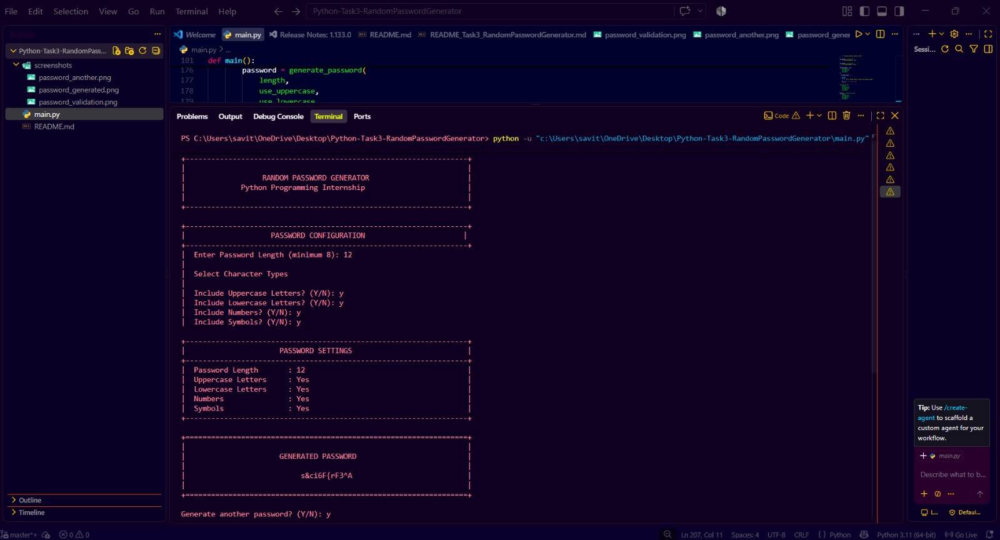
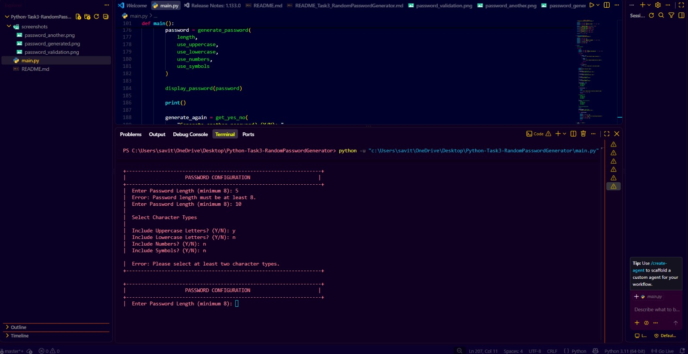
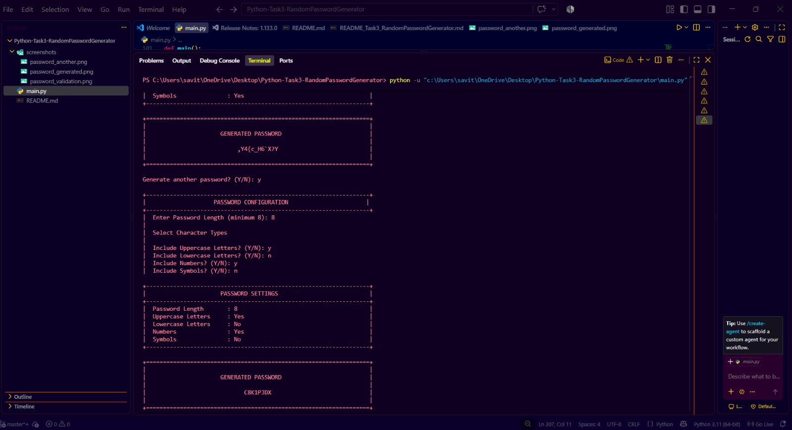

# Random Password Generator

## Project Overview

The Random Password Generator is a Python-based command-line application that generates customizable passwords based on the user's selected requirements.

The user can specify the password length and choose different character types, including uppercase letters, lowercase letters, numbers, and symbols.

The application also performs input validation and allows the user to generate multiple passwords without restarting the program.

This project was developed as part of the Python Programming Internship.

## Objectives

The main objectives of this project are:

- To develop a simple password generation application using Python.
- To generate random and customizable passwords.
- To allow users to select different character types.
- To validate user inputs.
- To ensure that generated passwords meet the selected requirements.
- To allow users to generate another password without restarting the application.
- To demonstrate the use of Python's built-in `random` and `string` modules.

## Features

- Generate passwords with a minimum length of 8 characters.
- Allow the user to specify the password length.
- Select uppercase letters.
- Select lowercase letters.
- Select numbers.
- Select symbols.
- Ensure at least one character from every selected character type.
- Randomly generate the remaining characters.
- Shuffle the generated characters for better randomness.
- Validate password length.
- Validate non-numeric password length.
- Validate invalid Y/N responses.
- Validate character-type selection.
- Require at least two character types.
- Generate another password without restarting the program.
- Simple and user-friendly command-line interface.

## Technologies Used

- Python
- `random` module
- `string` module

## Python Concepts Used

This project demonstrates the following Python concepts:

- Functions
- Conditional statements
- `while` loops
- `for` loops
- Exception handling
- User input
- String manipulation
- Lists
- Random character selection
- Character shuffling
- Boolean values
- Modular programming

## Character Types

The application supports four character types:

### 1. Uppercase Letters

```text
A-Z
```

### 2. Lowercase Letters

```text
a-z
```

### 3. Numbers

```text
0-9
```

### 4. Symbols

Special characters provided by Python's `string.punctuation`.

The user can choose which character types should be included in the generated password.

## How It Works

1. The application starts by displaying the Random Password Generator header.
2. The user enters the required password length.
3. The program checks whether the password length is at least 8 characters.
4. The user selects whether uppercase letters should be included.
5. The user selects whether lowercase letters should be included.
6. The user selects whether numbers should be included.
7. The user selects whether symbols should be included.
8. The program checks that at least two character types have been selected.
9. At least one character is selected from every chosen character type.
10. The remaining characters are randomly selected from the combined character pool.
11. The selected characters are shuffled.
12. The final password is displayed.
13. The user can choose to generate another password without restarting the program.
14. The program continues until the user chooses `N`.

## Password Generation Logic

The application first creates separate character sets based on the user's selections.

For example, if the user selects:

```text
Uppercase: Yes
Lowercase: Yes
Numbers: Yes
Symbols: Yes
```

the program creates a character pool containing all four selected character types.

The program then selects at least one character from each selected type.

The remaining positions are filled with randomly selected characters from the combined character pool.

Finally, the characters are shuffled before displaying the password.

This ensures that the selected character types are represented in the generated password.

## Input Validation

The application handles several invalid inputs.

### Invalid Password Length

If the user enters a password length less than 8:

```text
Enter Password Length (minimum 8): 5
Error: Password length must be at least 8.
```

The program asks the user to enter the length again.

### Non-Numeric Password Length

If the user enters something that is not a valid whole number, the program displays:

```text
Error: Please enter a valid whole number.
```

### Invalid Y/N Response

The character-type questions accept only:

```text
Y
N
```

If the user enters another value, the program displays:

```text
Error: Please enter Y or N.
```

### Insufficient Character Types

The program requires at least two character types.

For example:

```text
Uppercase: Y
Lowercase: N
Numbers: N
Symbols: N
```

produces:

```text
Error: Please select at least two character types.
```

## Generate Another Password

After generating a password, the application asks:

```text
Generate another password? (Y/N):
```

If the user enters:

```text
Y
```

the program allows the user to configure and generate another password without restarting the application.

If the user enters:

```text
N
```

the application exits with a thank-you message.

## Example

### Example 1 — All Character Types

```text
Enter Password Length (minimum 8): 12

Include Uppercase Letters? (Y/N): y
Include Lowercase Letters? (Y/N): y
Include Numbers? (Y/N): y
Include Symbols? (Y/N): y
```

Example output:

```text
Password Length       : 12
Uppercase Letters     : Yes
Lowercase Letters     : Yes
Numbers               : Yes
Symbols               : Yes

GENERATED PASSWORD

:R8*zapjXC?c
```

The generated password will be different each time because the application uses random character selection.

### Example 2 — Generate Another Password

After generating the first password:

```text
Generate another password? (Y/N): y
```

The application starts a new password configuration and generates another password without restarting.

## Project Structure

```text
Python-Task3-RandomPasswordGenerator/
│
├── main.py
├── README.md
│
└── screenshots/
    ├── password_generated.png
    ├── password_validation.png
    └── password_another.png
```

## File Description

| File / Folder | Description |
|---|---|
| `main.py` | Main Python program containing the password generator |
| `README.md` | Project documentation |
| `screenshots/` | Contains screenshots demonstrating the application |
| `password_generated.png` | Successful password generation screenshot |
| `password_validation.png` | Input validation screenshot |
| `password_another.png` | Generate another password demonstration |

## Screenshots

### 1. Password Generation

This screenshot demonstrates successful password generation with the selected character types.



### 2. Input Validation

This screenshot demonstrates the application's handling of invalid inputs such as an invalid password length and insufficient character-type selection.



### 3. Generate Another Password

This screenshot demonstrates that the application can generate another password without restarting.



## How to Run

### Prerequisites

Make sure Python is installed on your system.

Check the Python version using:

```bash
python --version
```

### Run the Application

1. Open the project folder.
2. Open PowerShell or Command Prompt inside the project folder.
3. Run:

```bash
python main.py
```

4. Enter the password length.
5. Select the required character types.
6. View the generated password.
7. Choose whether to generate another password.

## Sample Commands

### Check Python Version

```bash
python --version
```

### Run the Program

```bash
python main.py
```

## Testing

The application was tested using different input conditions.

| Test Case | Input / Condition | Expected Result |
|---|---|---|
| Valid password | Length 12 with all character types | Password generated successfully |
| Minimum length | Length 8 | Password generated successfully |
| Invalid length | Length less than 8 | Error message displayed |
| Non-numeric length | Text input | Error message displayed |
| Invalid Y/N input | Value other than Y/N | Error message displayed |
| One character type | Only one type selected | Error message displayed |
| Multiple character types | Two or more types selected | Password generated |
| Generate again | Enter `Y` | New password configuration starts |
| Exit | Enter `N` | Program exits successfully |

## Validation Results

The following validation cases were successfully tested:

- Password length below 8 was rejected.
- Non-numeric password length was handled.
- Invalid Y/N responses were rejected.
- Selection of fewer than two character types was rejected.
- Valid character-type selections generated passwords successfully.
- Multiple passwords could be generated without restarting the application.

## Advantages

- Easy to use.
- Simple command-line interface.
- Customizable password generation.
- Supports multiple character types.
- Provides input validation.
- Allows repeated password generation.
- Uses Python built-in modules.
- Lightweight and easy to run.

## Limitations

- The application is command-line based.
- Generated passwords are displayed directly in the terminal.
- The application does not store generated passwords.
- The application does not provide a graphical user interface.

## Future Enhancements

The project can be enhanced in the future by adding:

- A graphical user interface.
- Password strength indication.
- Copy-to-clipboard functionality.
- Password history.
- Secure password storage options.
- Additional password customization options.
- A web-based interface.

## Learning Outcomes

Through this project, I gained practical experience in:

- Python programming.
- Writing and using functions.
- Handling user input.
- Implementing input validation.
- Using loops and conditional statements.
- Working with strings and lists.
- Using Python's built-in modules.
- Implementing random character generation.
- Structuring a Python project.
- Testing a command-line application.

## Conclusion

The Random Password Generator is a simple and customizable Python application for generating passwords based on user-selected requirements.

The project successfully demonstrates password generation, character-type selection, input validation, random character selection, character shuffling, and repeated password generation.

This project provided practical experience in Python programming and helped demonstrate how built-in Python modules such as `random` and `string` can be used to build a useful application.

## Internship Project

**Project:** Random Password Generator  
**Domain:** Python Programming  
**Internship:** Python Programming Internship
